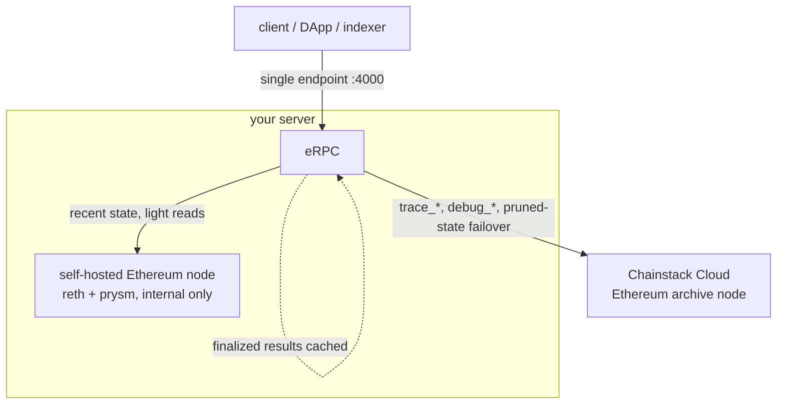

# Self-hosted Ethereum node + archive routing to Chainstack Cloud with eRPC

Run your own Ethereum node for the everyday RPC traffic, and let **eRPC** transparently forward the
heavy historical (archive) queries your node can't serve to a **Chainstack Cloud** archive node.
One endpoint for your apps; cheap local RPC; archive only when you actually need it.

This walkthrough uses **Ethereum Hoodi** (a testnet) as a low-cost, reproducible example. It's a
*mechanics* demo — the exact same setup on Ethereum mainnet or Base is where the cost savings land
(see [Going further](#going-further)).

> **Status of this doc:** built and verified end-to-end on a real run, including the final
> synced-node proof (section 7).

## 1. Why

A **full node** keeps recent state and is cheap to run. An **archive node** keeps *all* historical
state and is expensive (big disk, slow to sync). Most apps are 95% recent-state traffic and only
occasionally need archive (`trace_*`, `debug_*`, balances/state at old blocks).

So: self-host the cheap full node, and route the rare archive calls to a managed archive node. eRPC
sits in front of both as a single endpoint and decides per request.

## 2. Architecture



- **Self-hosted node** — primary. On this build it runs as Kubernetes pods (`reth` execution +
  `prysm` consensus) managed by Chainstack Self-Hosted. Its RPC is **internal only** — never exposed
  to the internet.
- **Chainstack Cloud archive node** — the failover/archive upstream. Billed only for what the full
  node can't serve.
- **eRPC** — runs on the same box (Docker). One endpoint; routes by method, fails over on error,
  and caches finalized data so repeat archive hits don't re-bill Cloud.

## 3. Get and secure a server

We used a **Velia** bare-metal box (Ubuntu 24.04, 12 vCPU / 31 GB RAM) ordered with the
**Chainstack Self-Hosted** management option — which ships the Control Panel **pre-installed**, so
the whole k3s/`cpctl` install is done for you. Promo `ChainstackSH80` gives 80% off the first month.

For Hoodi you need very little: ~6 vCPU, 32 GB RAM, ~500 GB disk. Mainnet needs much more (see
[System requirements](https://docs.chainstack.com/docs/self-hosted/requirements)).

If your box does *not* ship with the Control Panel pre-installed, `scripts/provision.sh` installs the
base tooling (k3s, helm, yq, `cpctl`) and stops before the interactive `cpctl install` — follow
[Quick start](https://docs.chainstack.com/docs/self-hosted/quick-start) from there.

### 3a. SSH key access
Use a key, not a password. Generate one locally and attach the **public** half to the server:

```bash
ssh-keygen -t ed25519 -f ~/.ssh/hoodi_build_key
# add ~/.ssh/hoodi_build_key.pub to the server (provider panel, or /root/.ssh/authorized_keys)
ssh -i ~/.ssh/hoodi_build_key root@<SERVER-IP>
```

### 3b. Harden the box (do this before anything else)
A fresh public server is scanned by bots within minutes. Minimum hardening:

```bash
# firewall: deny all inbound except SSH; keep Kubernetes internals working
apt-get install -y ufw fail2ban
ufw default deny incoming
ufw default allow outgoing
ufw allow 22/tcp
ufw allow in on lo
ufw allow from 10.42.0.0/16      # k3s pod CIDR
ufw allow from 10.43.0.0/16      # k3s service CIDR
ufw allow from <SERVER-IP>       # node talks to itself
ufw --force enable

# SSH: key-only
cat >/etc/ssh/sshd_config.d/99-harden.conf <<'C'
PasswordAuthentication no
PermitRootLogin prohibit-password
C
systemctl reload ssh

# ban brute-forcers
systemctl enable --now fail2ban
```

The Control Panel UI (Traefik) is published on ports 80/443 by k3s via a `hostPort`, which bypasses
ufw's INPUT chain. Block it from the internet at the raw table (find your public NIC with
`ip route get 8.8.8.8`):

```bash
iptables -t raw -I PREROUTING -i <PUBLIC-IF> -p tcp -m multiport --dports 80,443 -j DROP
```

Reach the Control Panel later over an SSH tunnel instead:
`ssh -i ~/.ssh/hoodi_build_key -L 8080:localhost:80 root@<SERVER-IP>` → `http://localhost:8080`.

> ⚠️ Also change your server's **IPMI/BMC** password — it's separate hardware and a common takeover
> vector.

After hardening, only SSH is reachable from the internet; the node RPC, k8s API, and Control Panel
are all private.

### 3c. Put chain data on NVMe (do this before deploying the node)

**This bit matters for sync speed.** k3s's default `local-path` storage lives on the OS disk. On
many bare-metal boxes that's a SATA SSD, while the fast NVMe drives ship **raw and unused** — so a
node deployed with defaults syncs on the *slow* disk. We learned this the hard way: initial Execution
sync on SATA was painfully slow while two NVMe sat idle.

Point k3s storage at NVMe first. On this box (two raw NVMe) we striped them (RAID0) for max
throughput and repointed `local-path`:

```bash
# RAID0 across both NVMe -> one fast 1.9 TB volume (RAID0 = no redundancy; fine for a resyncable node)
apt-get install -y mdadm
mdadm --create /dev/md0 --level=0 --raid-devices=2 /dev/nvme0n1 /dev/nvme1n1 --run
mkfs.ext4 -F /dev/md0
mkdir -p /mnt/chaindata && mount /dev/md0 /mnt/chaindata
echo '/dev/md0 /mnt/chaindata ext4 defaults,nofail 0 0' >> /etc/fstab
mdadm --detail --scan > /etc/mdadm/mdadm.conf
mkdir -p /mnt/chaindata/storage

# repoint k3s local-path default to the NVMe volume (affects newly-created PVCs)
kubectl -n kube-system get cm local-path-config -o jsonpath='{.data.config\.json}'   # note current path
# edit nodePathMap paths -> ["/mnt/chaindata/storage"], then:
kubectl -n kube-system rollout restart deploy local-path-provisioner
```

A single NVMe (skip RAID) is plenty for Hoodi; RAID0 just doubles throughput. For a Chainstack-blessed
multi-disk setup, use LVM + TopoLVM per [Environment setup](https://docs.chainstack.com/docs/self-hosted/environment-setup).
**Do this before Create node** so the node's volume is provisioned on NVMe from the start (changing it
later means deleting and resyncing the node).

## 4. Deploy the self-hosted Hoodi node

Chainstack Self-Hosted deploys nodes through the Control Panel UI (`cpctl` manages the platform, not
nodes). Log in (user `root`, the bootstrap password from your provider email), then:

1. **Nodes → Create node**
2. Protocol **Ethereum** → Network **Hoodi** → preset **Light** (4 vCPU / 16 GiB)
3. **Create node**

It spins up `reth` (execution) + `prysm` (consensus) pods in the `control-panel-deployments`
namespace. The node's RPC is a ClusterIP service (`*-reth-rpc`, port 8545) — internal only.

The node then syncs. reth uses **staged sync** (headers → bodies → sender-recovery → execution → …);
`eth_blockNumber` stays `0x0` until the final stage, and `eth_syncing` returns `false` when caught up.

## 5. Deploy the Chainstack Cloud archive node

In the [Chainstack console](https://console.chainstack.com): create/choose a project → **Deploy node**
→ **Ethereum → Hoodi → Node type: Archive** → Create. Copy the HTTPS endpoint (includes the auth key).

Verify it's archive-capable:

```bash
curl -s https://ethereum-hoodi.core.chainstack.com/<KEY> -H 'Content-Type: application/json' \
  --data '{"jsonrpc":"2.0","id":1,"method":"trace_block","params":["0x1"]}'
# returns a result (not -32601 method not found)
```

## 6. Configure and run eRPC

eRPC is open-source and runs from a single Docker image. Install Docker if needed
(`curl -fsSL https://get.docker.com | sh`).

`erpc/erpc.yaml`:

```yaml
logLevel: info
# server defaults to :4000 (RPC) and :4001 (metrics) — do NOT set server.port/metrics.port,
# this build rejects those fields.
database:
  evmJsonRpcCache:
    connectors:
      - id: memory
        driver: memory
        memory: { maxItems: 100000 }
    policies:
      - { network: "*", method: "*", finality: finalized,   connector: memory, ttl: 0 }
      - { network: "*", method: "*", finality: unfinalized, connector: memory, ttl: 5s }
projects:
  - id: main
    networks:
      - architecture: evm
        evm: { chainId: 560048 }          # Ethereum Hoodi
        failsafe:
          - matchMethod: "*"
            timeout: { duration: 30s }
            retry:   { maxAttempts: 2, delay: 200ms }   # primary errors -> fail over to Cloud
            hedge:   { delay: 3000ms, maxCount: 1 }
    upstreams:
      - id: self-hosted-eth               # primary: local node
        endpoint: ${SELF_HOSTED_RPC_URL}
        evm: { chainId: 560048 }
        ignoreMethods: ["trace_*", "debug_*"]   # archive-only methods never hit the full node
        failsafe: [{ matchMethod: "*", timeout: { duration: 10s } }]
      - id: chainstack-cloud-eth          # archive + failover
        endpoint: ${CLOUD_RPC_URL}
        evm: { chainId: 560048 }
        tags: ["tier:fallback"]
        failsafe: [{ matchMethod: "*", timeout: { duration: 20s } }]
```

The three routing behaviors: **method routing** (`ignoreMethods` keeps `trace_*`/`debug_*` off the
full node → they go to Cloud), **error failover** (`retry` promotes a request to Cloud when the local
node errors, e.g. pruned old state), and **finality cache** (finalized results cached forever).

Run eRPC on the same box with host networking, so it reaches the node over the cluster network and
the Cloud over the internet while its own ports 4000 and 4001 stay firewalled from outside. Point it
at the node's `reth-rpc` **ClusterIP**, which is routable from the k3s host (kube-proxy programs it
into the host's iptables). Prefer this over `kubectl port-forward` — a port-forward is a foreground
process that dies on every disconnect and silently drops the self-hosted upstream:

```bash
# reth-rpc ClusterIP (stable while the node exists; re-read it if you redeploy the node)
SVC_IP=$(kubectl -n control-panel-deployments get svc -o jsonpath='{range .items[*]}{.metadata.name}{" "}{.spec.clusterIP}{"\n"}{end}' | awk '/reth-rpc/{print $2}')

cat > erpc.env <<E
SELF_HOSTED_RPC_URL=http://${SVC_IP}:8545
CLOUD_RPC_URL=https://ethereum-hoodi.core.chainstack.com/<KEY>
E

docker run -d --name erpc --restart unless-stopped --network host \
  -v $(pwd)/erpc.yaml:/erpc.yaml --env-file erpc.env ghcr.io/erpc/erpc:main
```

> **Changing an upstream URL later?** `docker restart erpc` does **not** re-read `--env-file` — the env
> is fixed when the container is created. Edit `erpc.env`, then `docker rm -f erpc` and `docker run …`
> again. A plain restart leaves the old URL baked in and eRPC keeps hitting the stale endpoint.

eRPC boots with both upstreams and the network ready:

```
upstreamId=self-hosted-eth   ... bootstrapped evm state poller
upstreamId=chainstack-cloud-eth ... bootstrapped evm state poller
networks bootstrap completed
```

## 7. Test and prove the split

`scripts/test-routing.sh` fires representative calls; `scripts/verify.sh` reads eRPC's Prometheus
metrics (`erpc_upstream_request_total`) and asserts which upstream served each.

Archive path (works immediately, verified on this build):

```bash
curl -s http://localhost:4000/main/evm/560048 -H 'Content-Type: application/json' \
  --data '{"jsonrpc":"2.0","id":1,"method":"trace_block","params":["0x1"]}'
# served via the Cloud upstream ✓
```

Full split (`recent → self-hosted`, `archive → Cloud`) requires the local node fully synced
(`eth_syncing=false`) — until then eRPC treats it as unhealthy and routes everything to Cloud. Once
synced:

```bash
./scripts/test-routing.sh && ./scripts/verify.sh
# PASS: recent call served by self-hosted
# PASS: archive call served by Cloud
```

Real output from this build once the node reached tip (`eth_syncing=false`, head block `0x306a48`):

```
$ curl -s http://<reth-rpc ClusterIP>:8545 -d '{"jsonrpc":"2.0","id":1,"method":"eth_syncing","params":[]}'
{"jsonrpc":"2.0","id":1,"result":false}

$ ./scripts/test-routing.sh && ./scripts/verify.sh
== recent (expect served by self-hosted) ==
{ "jsonrpc": "2.0", "id": 1, "result": "0x306a42" }
== archive method (expect served by Cloud) ==
== old-state read (expect failover to Cloud on pruned state) ==
{ "jsonrpc": "2.0", "id": 1, "result": "0x0" }

PASS: recent call served by self-hosted
PASS: archive call served by Cloud
```

The split is confirmed in eRPC's own metrics: `erpc_upstream_request_total{upstream="self-hosted-eth",
category="eth_blockNumber",finality="realtime"}` increments on recent reads, while
`{upstream="chainstack-cloud-eth",category="trace_block"}` carries the archive calls.

## Going further

- On **mainnet / Base**, the full node is bigger (2–3.5 TB NVMe) but the archive-offload savings are
  real — you avoid self-hosting a fast-growing archive and pay Cloud only for the slice you can't
  serve. Same eRPC config, different `chainId`.
- Combine with a Proxmox VM helper to template the box.
- The pattern generalizes to any Self-Hosted EVM chain (Optimism, Unichain, Zora, Ethereum).
